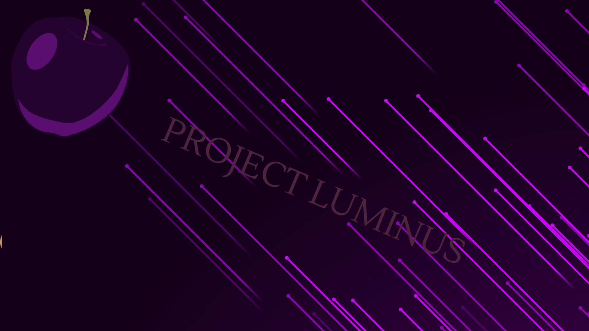

# About
--------
Project Luminus is a distro for x86x64 thats designed for people getting used to linux that is intreasted in cybersecurity. Made on top of EOS, Luminus is designed to be a middle between Kali linux and Blackarch. Luminus, by default has an dual desktop environment setup of lightdm with Niri+dms And Xfce4. The reason its setup like this is for those who prefer a mix of Unix and Linux desktops

# What makes it different
--------
Project Luminus is made to have the quick setup that EOS provides alongside calamares with the addition of arch's unrestrictive natrue. Realisticlly I rarely see people that aren't learning cybersecurity or following videos use Kali. (This isn't an attempt at comparing to Kali linux. This is just another distro with preinstalled crybersecurity tools and firewalls)

For example many people on reddit suggest BlackBox, BlackArch, ParrotOS or another distrobution once you become serius about security. that is for realistic and less handholding then Kali-Linux does

The main reason I created Luminus is because I wanted a distro for those who are above linux basics they can learn from Kali, but is unable use Unix or Linux enough to setup their own. While there isn't currently guides for some of the pre-installed tools, the philosophy of Project-Luminus is just to be something thats future proof without major removal while offering a portable live/static usb with everything you need to quick scripting or development.

# Documents
--------

[Builtin-Runtimes](assets/packages/runtimes.md)

[Scanning Packages](assets/packages/security-scanning.md)

[Default-Applications](assets/packages/default-applications.md)

[Firewalls]()

# Installation
---------
# Default look
------------

# Translation
---------
Русский перевод[]

Traducción al español[]

한국어 번역[]

हिन्दी अनुवाद[]

-------

Translations below are created using [Papago](https://papago.naver.com/)

Project Luminus is under the General Public License v3.0
